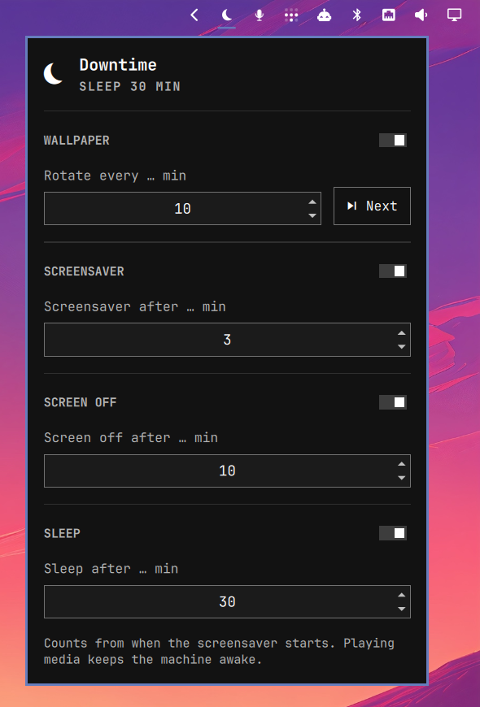

# Downtime 💤

Screensaver, screen dimming, screen off, sleep, a shutdown timer and wallpaper rotation for [Omarchy](https://omarchy.org/), set from one bar widget.

<p align="center">
  
</p>

Omarchy can start a screensaver and lock on idle out of the box. Downtime adds the steps after that: turn the screen off, put the machine to sleep, or shut it down at a set time.

An independent [MIT](LICENSE)-licensed plugin. Not affiliated with or endorsed by 37signals.

## What it does

Each setting has a small on/off switch next to its title. The minutes are kept while it is off.

| Setting | Default | Notes |
| --- | --- | --- |
| Wallpaper rotation | off, 10 min | Calls `omarchy-theme-bg-next`. Right-click the widget for the next one. |
| Screensaver | unchanged | Omarchy's own `idle.screensaver` and screensaver toggle. Left exactly as they are until you change them in the widget. |
| Dim during screensaver | off, 40 % | Lowers every display to this brightness while the screensaver runs and restores it afterwards. |
| Screen off | 10 min | Via hypridle. |
| Sleep | off, 30 min | Via hypridle and `systemctl suspend`. |
| Shutdown timer | off, 1 h | One-shot, in hours and minutes. Counts real time, not idle time, and powers off with `systemctl poweroff`. |

Things worth knowing:

- **Times count from when the screensaver starts.** Opening the screensaver resets the idle clock. With screensaver 5 and sleep 30, the machine sleeps after about 35 minutes.
- **Playing media keeps the machine awake.** Inhibitors from browsers and video players are respected.
- **The screensaver is closed before sleep**, so you wake up to your desktop, not to the screensaver.
- **The shutdown timer is one-shot.** The switch starts the countdown and cancels it. A notification confirms the time, and another one comes one minute before. Sleep is paused and greyed out while it runs, because a sleeping machine would never shut down. The timer survives a shell restart and is cancelled when the plugin is disabled or removed. The chosen time is kept for next time.
- **Dimming needs a display whose brightness Omarchy can set.** It uses `omarchy-brightness-display`, the same path as the brightness keys: the backlight on laptops, DDC/CI on external monitors. If no display can be dimmed, the switch is greyed out with a hint. On a monitor, DDC/CI may have to be turned on in its own menu. If your brightness keys work, dimming works too.
- **Brightness always comes back.** Each change is read back and retried, displays still waking up from screen off are waited for (even monitors that vanish for a moment while they wake up), and anything left dimmed without a screensaver is restored within seconds. Displays already darker than the target are left alone.
- **The panel warns when hypridle is missing**, and starts the timings on its own once it is installed.
- **Locking is not changed.** Omarchy still locks the screen before sleep. If you do not want a password after wake, see [Sleep without a password](#sleep-without-a-password).

## Install

```sh
omarchy plugin add https://github.com/heast13/omarchy-downtime.git --enable
```

Downtime needs `hypridle`. If it is missing:

```sh
omarchy pkg add hypridle
```

> [!IMPORTANT]
> Plugins run as unsandboxed code inside `omarchy-shell`. Only add repos you trust, and read the source before you enable one.

## Update

```sh
omarchy plugin update heast13.downtime
omarchy restart shell
```

Restart the shell after an update. A running shell can keep the old version of the plugin's background service loaded.

## How it works

- `Service.qml` reads the widget's settings straight from `~/.config/omarchy/shell.json` and runs `scripts/apply` whenever a timing changes, and once at login.
- Enabling the plugin changes none of your settings. The screensaver stays as it is until you change it in the widget, and your `~/.config/hypr/hypridle.conf` is never touched.
- `scripts/apply` takes exactly four values and refuses anything else, so a mismatched or half-updated caller changes nothing.
- `scripts/shutdown` runs the shutdown timer as the transient user units `downtime-shutdown.timer` and `downtime-shutdown-warn.timer`, and keeps its deadline in `~/.local/state/downtime/shutdown-at`.
- `scripts/apply` writes `~/.local/state/downtime/hypridle.conf` and runs hypridle with it as the user unit `downtime-hypridle.service`. Your own `~/.config/hypr/hypridle.conf` is never touched.
- `scripts/dim` saves each display's brightness in `~/.local/state/downtime/dim-saved` while the screensaver runs. The service watches Hyprland for the screensaver's windows.
- Disabling or removing the plugin stops that unit and restores dimmed displays.

If you already start hypridle yourself (for example in `~/.config/hypr/autostart.lua`), both run side by side and Downtime shows a notification. Remove one of them.

Check what is running:

```sh
systemctl --user status downtime-hypridle.service
cat ~/.local/state/downtime/hypridle.conf
```

## Language

The UI follows the system locale and falls back to English. Click the **EN** / **DE** button at the bottom right of the panel to switch. From a terminal:

```sh
omarchy bar set heast13.downtime language de
```

`en`, `de` or `auto` (the default).

## Sleep without a password

Omarchy locks the screen right before sleep with the user unit `omarchy-sleep-lock.service`. On a desktop nobody else uses, you can turn that off:

```sh
systemctl --user mask --now omarchy-sleep-lock.service
```

Undo:

```sh
systemctl --user unmask omarchy-sleep-lock.service
systemctl --user enable --now omarchy-sleep-lock.service
```

Only do this on a machine you trust everyone around.

## Uninstall

```sh
omarchy plugin remove heast13.downtime
rm -rf ~/.local/state/downtime
```

The screensaver delay stays at the last value. Change it back in `~/.config/omarchy/shell.json` under `idle.screensaver` if you like.

## License

[MIT](LICENSE)
